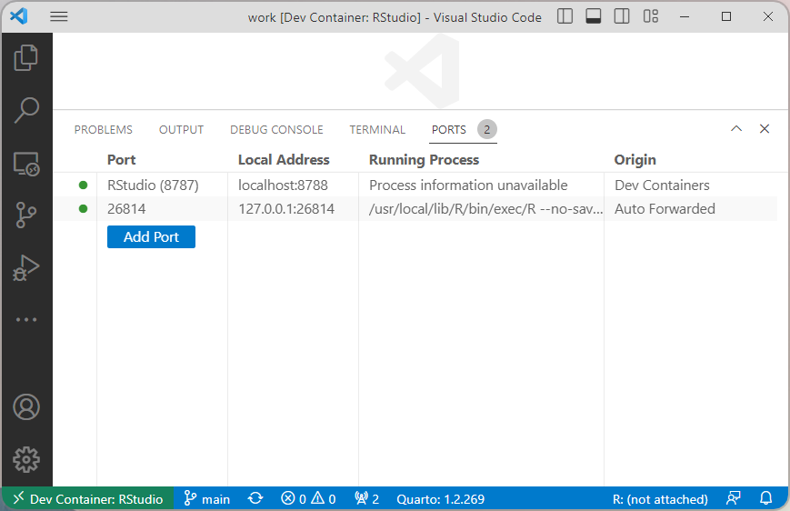

# R and RStudio in Devcontainer

The code in this repository provides a way to start an R development environment along with an RStudio interface. The environment is based on [rocker container images](https://rocker-project.org/images/versioned/rstudio.html).

## Introduction to Development Containers and Codespaces

If you are familiar with Visual Studio Code, the concept of devcontainer in VS Code, and Codespaces, skip to the next section.

If the concept of containers are new to you, I recommend reading the section on [containers in data science](https://the-turing-way.netlify.app/reproducible-research/renv/renv-containers.html) context in [The Turing Way handbook](https://the-turing-way.netlify.app/welcome.html). 

[Devcontainer in Visual Studio Code](https://code.visualstudio.com/docs/devcontainers/containers) allows VS Code to deploy and connect to a container instance and provide seamless access to software tools inside the container. [GitHub Codespaces](https://docs.github.com/en/codespaces/setting-up-your-project-for-codespaces/adding-a-dev-container-configuration/introduction-to-dev-containers) is a way to start a web-based VS Code interface and connect to a container running on GitHub's infrastructure.

Devcontainer specification are given in file `.devcontainer/devcontainer.json`. The container images are [fully customizable](https://code.visualstudio.com/docs/devcontainers/create-dev-container#_path-to-creating-a-dev-container) using `Dockerfile` and `docker-compose.yml` that also live in `.devcontainer` directory. See the section on [What this repository provides](#what-this-repository-provides) for more details on customizing files in this repository.


## Using R and RStudio in a container

After starting up a [Codespace](https://code.visualstudio.com/docs/remote/codespaces#_getting-started) session or [VS Code devcontainer](https://code.visualstudio.com/docs/devcontainers/tutorial#_get-the-sample) environment with this repository, open the command palette (`Ctrl+Shift+P`), and start typing `Ports: Focus on Ports View`.

In Ports View, you will see an entry that says "RStudio (8787)". Click on the link under "Local Address" to open a browser window to login to your RStudio server!! The default username is `rstudio`, and the default password is `test-password` (See below for [changing the password](#changing-rstudio-password)).





## Changing RStudio password

A custom password for accessing RStudio can be set with the `PASSWORD` variable in `environment` section of `docker-compose.yml` file. As you can see, the default password is set as `test_password`.

```
environment:
    PASSWORD: "${RSTUDIO_PASSWORD:-test_password}"
```

I recommend changing the password to something secure. The password string can be supplied securely in two ways depending on where your container is running. If you wanted to set the password as `your-password`,

1. When using Codespaces, add a [secret](https://docs.github.com/en/codespaces/managing-your-codespaces/managing-encrypted-secrets-for-your-codespaces#adding-a-secret) with  
    - "Name": `RSTUDIO_PASSWORD` 
    - "Value": `your-password`
2. In VS Code, you can create a `.env` file in `.devcontainer` directory and set a variable,  
    ```bash
    RSTUDIO_PASSWORD='your-password'
    ```
    Note that you should not add `.env` file to your repository.


## What this repository provides

Following files in this repository are the essential pieces for running RStudio in development containers.

* [`.devcontainer/devcontainer.json`](.devcontainer/devcontainer.json)
* [`.devcontainer/Dockerfile`](.devcontainer/Dockerfile)
* [`.devcontainer/docker-compose.yml`](.devcontainer/docker-compose.yml)


### Devcontainer configuration: `devcontainer.json`

[`devcontainer.json`](.devcontainer/devcontainer.json) is the main configuration file for specifying a devcontainer. ([documentation on `devcontainer.json`](https://containers.dev/implementors/json_reference/)).

### Development environment: `Dockerfile`

[`Dockerfile`](.devcontainer/Dockerfile) specifies the content of the container image. Modifying this file will customize the contents of your devcontainer: e.g. system libraries, R, and RStudio.

As the first line suggests, the `Dockerfile` extends a [`tidyverse` image](https://rocker-project.org/images/versioned/rstudio.html) from Rocker project. The additions in the `Dockerfile` are:

- Minimal python installation from [Jupyter project's base-notebook image](https://jupyter-docker-stacks.readthedocs.io/en/latest/using/selecting.html#jupyter-base-notebook). This is mostly to install `radian` package for R terminal.
- System libraries, `curl` and `libxt6` (to remove a warning message)
- [Quarto](https://quarto.org) publishing system and `tinytex`
- Other packages to support VS Code extensions for R and Rmarkdown: `languageserver`, 'httpgd', 'ManuelHentschel/vscDebugger`.

For example, adding the folliwng line installs an R package, `devtools`:
```Dockerfile
RUN install2.r devtools
```
Adding the following line installs a Python package using `pip`:
```Dockerfile
RUN pip install pyjoke
```
Adding the following lines install a system package for Ubuntu (underlying OS for the base image being used).
```Dockerfile
RUN apt update && \
    apt install -y --no-install-recommends curl && \
    rm -rf /var/lib/apt/lists/*
```
Reference: [installing system packages](https://docs.docker.com/develop/develop-images/dockerfile_best-practices/#run) in `Dockerfile`.

### Container launch configuration: `docker-compose.yml`

[`docker-compose.yml`](.devcontainer/docker-compose.yml) specifies container initialization and sets environment variables. One important role of `docker-compose.yml` is setting the password for RStudio access. See above for the section on [changing the password](#changing-rstudio-password).